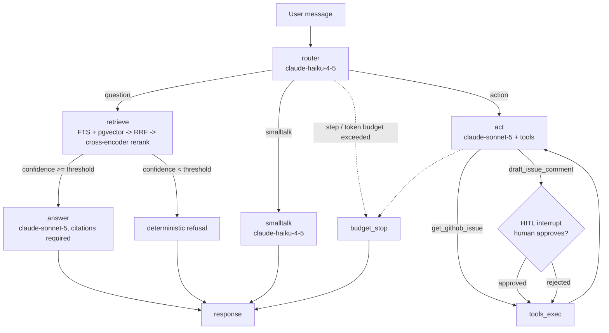

<p align="center"></p>

# Anvil

A support agent over real product documentation, evaluated on real user questions, built the way an enterprise agent should be built: evals first.
The worked example is FastAPI: Anvil ingests 118 pages of the actual FastAPI docs, answers questions with citations, refuses when the docs have no answer, fetches real GitHub issues, and drafts issue comments behind a human approval interrupt.
The architecture is product-agnostic; point the ingestion at any markdown docs tree and rebuild the goldens.
The centerpiece is the measurement system around it: a retrieval golden set built from real Stack Overflow and GitHub questions, a golden set of end-to-end conversations, a CI regression gate, walkable Langfuse traces, and a cost-per-conversation number computed from a real token ledger.

## Measured baseline

Retrieval quality on the 52-query golden set (real user questions, labeled by inspection), hybrid search + cross-encoder rerank, fallback embedder (`all-MiniLM-L6-v2`), 1,199-chunk corpus:

```
recall@5   0.5673
recall@10  0.7404
MRR        0.5658
nDCG@10    0.5847
```

Fusion-only (no reranker) scores recall@5 0.4615, recall@10 0.6250, MRR 0.4077, nDCG@10 0.4385 on the same set, so the reranker is worth roughly ten recall points at k=5 and fifteen MRR points here.
These numbers are lower than a toy corpus would produce, because the questions are real (vague titles, error messages, XY problems) and the corpus is real (1,199 chunks with heavy topical overlap).
This is the fallback-embedder baseline: the eval runs with zero keys using a local MiniLM embedder, and the identical harness runs with `text-embedding-3-small` via `anvil eval retrieval --embedder openai` when `OPENAI_API_KEY` is set.
The gate refuses to compare runs across embedders and catches regressions from this baseline.

## Quickstart

Bring your own keys, start Postgres, and run the full loop:

```bash
docker compose up -d postgres
uv sync
export ANTHROPIC_API_KEY=sk-ant-...
export OPENAI_API_KEY=sk-...

uv run anvil ingest --embedder openai
uv run anvil eval retrieval --embedder openai
uv run anvil eval agent
uv run anvil report
```

`anvil ingest` builds the hybrid index with `text-embedding-3-small`; `anvil eval retrieval` scores it against the 52-query golden set and writes `eval_results/retrieval-<ts>.json` labeled with the embedder.
`anvil eval agent` runs the 42 golden conversations through the live graph with `claude-sonnet-5` (answer, act, judge) and `claude-haiku-4-5` (router, smalltalk); the tool cases fetch live GitHub issues over the public API, and unauthenticated quota (60 requests/hour) is sufficient.
`anvil eval agent --skip-judge` runs the deterministic checks only.
`anvil report` prints the exact cost of the run from the token ledger.

Talk to the agent directly:

```bash
uv run anvil ask "How do I enable CORS in FastAPI?"
uv run anvil ask "Look up fastapi issue 2595 and draft a comment explaining the httpx requirement."
uv run anvil chat
```

`anvil chat` pauses inline for comment-draft approvals (the HITL interrupt) and persists threads in a SQLite checkpointer under `.anvil/`.
Approved drafts are recorded in `data/backend/comment_drafts.json`; nothing is ever posted to GitHub.

Freeze a passing run as a baseline and gate future runs against it:

```bash
cp "$(ls -t eval_results/retrieval-*.json | head -1)" baselines/retrieval_openai_baseline.json
uv run anvil gate --baseline baselines/retrieval_openai_baseline.json
```

The same pattern works for agent runs (`baselines/agent_baseline.json`).
The CI gate stays on the fallback baseline (`baselines/retrieval_baseline.json`) because CI runs keyless; the gate refuses cross-embedder comparisons anyway.

### Zero-key path

Ingestion, the retrieval eval, the gate, and the full test suite also run with no keys at all, using the local MiniLM fallback embedder:

```bash
uv run anvil ingest --embedder fallback
uv run anvil eval retrieval --embedder fallback
uv run anvil gate
uv run pytest
```

The committed corpus snapshot means no network is needed for any of the above; this is the arm CI runs on every push.
To refresh the corpus from upstream: `uv run python scripts/fetch_corpus.py` (fetches the pinned commit; edit `PINNED_COMMIT` to bump).

### Providers

Generation is provider-agnostic: it resolves through LangChain's `init_chat_model`, so the model config is a provider-qualified `provider:model` string and the default is `anthropic:claude-sonnet-5`.
Switch providers by setting `ANVIL_ANSWER_MODEL` (and `ANVIL_CHEAP_MODEL` / `ANVIL_JUDGE_MODEL`) and the matching key, e.g. `ANVIL_ANSWER_MODEL=openai:gpt-5.4` with `OPENAI_API_KEY`, or `google_genai:gemini-2.5-pro` with `GOOGLE_API_KEY` after `uv sync --extra google`.
Embeddings are OpenAI-or-local: `text-embedding-3-small` when `OPENAI_API_KEY` is set, otherwise a local CPU fallback (`all-MiniLM-L6-v2`) that CI uses.

## The problem this design answers

Support agents fail quietly: they hallucinate answers, cite nothing, call the wrong tool, or post things nobody approved.
Anvil's position is that every one of those failure modes must be a number that CI can watch.
Retrieval quality is measured against labeled chunks, groundedness against an LLM judge plus a citation check, refusal behavior against questions the docs genuinely cannot answer, tool use against expected calls and arguments, and the write boundary against an interrupt that must fire.
A change that regresses any of it fails `anvil gate` and the build goes red.

## Architecture



The graph is LangGraph with a SQLite checkpointer, so state survives process restarts and `anvil ask --thread <id>` continues an earlier conversation.
Every run carries budget guards (max steps, max tokens per run) that terminate runaway tool loops with an explicit message.

Retrieval is hybrid: Postgres full-text (`tsvector`, `ts_rank_cd`) and pgvector cosine each return 50 candidates, Reciprocal Rank Fusion merges them, and a `ms-marco-MiniLM-L-6-v2` cross-encoder reranks the top 25 on CPU, which is standard second-stage practice.
The top rerank score doubles as a grounding-confidence signal: below the threshold the agent refuses deterministically without spending an LLM call.
Chunking is heading-aware markdown (details and tradeoffs in DECISIONS.md), which yields human-readable chunk ids like `tutorial-cors#use-corsmiddleware` that serve as citation targets and eval labels.

## Tools: real actions, real boundary

`get_github_issue` fetches live issues from the GitHub public API (`fastapi/fastapi` by default); tests replay recorded fixtures under `fixtures/github/` so they run offline.
`draft_issue_comment` writes a comment draft that is held behind a LangGraph interrupt until a human approves or rejects it.
Nothing is ever posted to GitHub from this codebase; the HITL approval boundary is the demonstrated part, and actually posting would be one authenticated call after approval.

## Corpus: the real FastAPI documentation

`corpus/` holds 118 processed pages of the official FastAPI docs: the full tutorial (51 pages), advanced guide (34), deployment (9), how-to recipes (12), reference (5), and 7 core top-level pages (async, Python types, CLI, environment, features).
`scripts/fetch_corpus.py` fetches them from `github.com/fastapi/fastapi` at pinned commit `7cb06f360dd44efac059848df1a9beee7643b018`, inlines the docs' code-include directives from `docs_src/`, converts MkDocs-Material markup to plain markdown, and records full provenance in `corpus/PROVENANCE.json`.
The processed snapshot (about 0.9 MB) is committed so evals are reproducible without network access; re-run the script only to bump the pinned commit.
FastAPI's documentation is MIT licensed; copyright Sebastián Ramírez and contributors.

## Evals: the centerpiece

Layer 1, retrieval (`anvil eval retrieval`, gates CI).
52 golden queries, every one a real user question: 45 mined from Stack Overflow question titles and 7 from FastAPI GitHub issues, each carrying its source URL in `goldens/retrieval.jsonl`.
Relevant chunks were labeled by inspection of the corpus (that is golden-set curation, the one place a human belongs in the loop).
`anvil eval retrieval` computes recall@5, recall@10, MRR, and nDCG@10 and validates every label against the ingested corpus first, so a renamed heading fails loudly.

Layer 2, end-to-end agent (`anvil eval agent`, needs `ANTHROPIC_API_KEY`).
42 golden conversations, again from real questions: 16 grounded answers with expected citations, 10 refusals against questions the docs genuinely cannot answer (rate limiting, favicons, refresh tokens, API versioning, all with source URLs), 10 GitHub-issue lookups with expected arguments, 5 comment drafts through the HITL interrupt (approve and reject paths), 1 smalltalk.
Deterministic checks run first: citation present and citing the expected documents, refused-when-should, correct tool with correct argument subset, interrupt fired when required.
A `claude-sonnet-5` judge then scores faithfulness and relevancy per Ragas conventions.
The full harness, including interrupts and judging, is exercised in the test suite against recorded fixtures (`fixtures/`), so the suite runs offline and deterministic.

Layer 3, the gate.
`anvil gate` compares the latest run against a committed baseline JSON and exits nonzero when any metric drops more than the tolerance (default 0.02).
GitHub Actions runs lint, the full test suite, ingestion, the keyless retrieval eval, and the gate on every push.

## Refusal calibration, measured on real data

On the real corpus the answerable and unanswerable populations overlap: answerable questions have a median rank-1 rerank score of 4.4 but 5 of 52 score below 0, while known-gap questions range from -9.7 to 4.6 with 4 of 10 below 0.
The deterministic threshold sits at 0.0 (the cross-encoder's own relevance boundary) and catches the clearly-off queries for free; gaps that still retrieve plausible-looking chunks are handled by the prompt-layer refusal, which is why the design has two layers.

## Cost per invocation

Every LLM call in the graph writes node, model, and exact token counts to a JSONL ledger; prices are a single source-commented table (July 2026 list prices: claude-sonnet-5 at $3/$15 per MTok, claude-haiku-4-5 at $1/$5).
`anvil report` prints total cost, cost by model, and mean cost per conversation with a confident decimal, because the number comes from counted tokens rather than a guess.

## Observability

Langfuse (self-hosted, v3) is integrated through its LangChain callback and is strictly env-gated: without `LANGFUSE_*` keys it is a no-op.
`docker compose --profile observability up -d` brings up the full stack (web, worker, Postgres, ClickHouse, Redis, MinIO).
Open http://localhost:3000, create an org/project, and export `LANGFUSE_PUBLIC_KEY`, `LANGFUSE_SECRET_KEY`, and `LANGFUSE_HOST=http://localhost:3000`.
Every `anvil ask`, `anvil chat`, and `anvil eval agent` run then produces a walkable trace of router decision, retrieval, answer or tool calls, and judge scores.

## MCP surface

`uv run anvil-mcp` starts a stdio MCP server exposing `search_docs` and `get_github_issue` against the same backend the agent uses, so Claude Desktop or any MCP client can drive the system directly.
Comment drafts stay agent-only because they belong behind the HITL interrupt.

## flux control plane (optional)

anvil exposes an optional A2A surface for the [flux](../flux) fleet control plane, behind the `a2a` extra and a separate entrypoint, so the CLI, MCP server, and the test suite are untouched.

```bash
uv sync --extra a2a
FLUX_OTLP_ENDPOINT=http://127.0.0.1:3100/v1/traces ANVIL_A2A_EMBEDDER=fallback uv run --extra a2a anvil-a2a
```

It serves a real A2A Agent Card at `/.well-known/agent-card.json` describing the `answer_grounded_question` skill, and a task endpoint at `/a2a/tasks` that honors an incoming W3C `traceparent` so its retrieve/rerank/answer spans join the caller's distributed trace.
With `FLUX_OTLP_ENDPOINT` unset there is no tracer and nothing to install; this is purely additive.

## Attribution

The corpus is the FastAPI documentation, MIT licensed, from https://github.com/fastapi/fastapi at commit `7cb06f360dd44efac059848df1a9beee7643b018` (see `corpus/PROVENANCE.json`).
Golden-set questions are titles of public Stack Overflow questions (CC BY-SA, linked per query) and FastAPI GitHub issues (linked per case); the relevance labels and expected-behavior annotations are original work in this repository.
