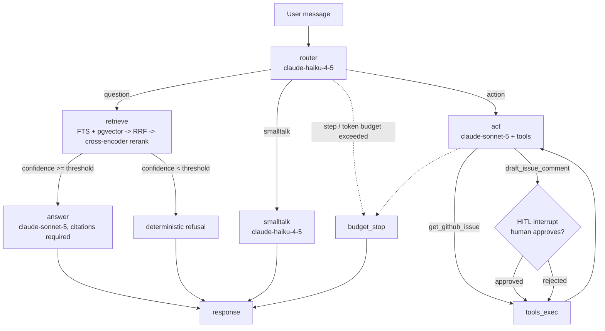

<p align="center"></p>

# Anvil

A support agent over real product documentation, evaluated on real user questions, built the way an enterprise agent should be built: evals first.
The worked example is FastAPI: Anvil ingests 118 pages of the actual FastAPI docs, answers questions with citations, refuses when the docs have no answer, fetches real GitHub issues, and drafts issue comments behind a human approval interrupt.
The architecture is product-agnostic; point the ingestion at any markdown docs tree and rebuild the goldens.
The centerpiece is the measurement system around it: a retrieval golden set built from real Stack Overflow and GitHub questions, a golden set of end-to-end conversations, a CI regression gate, walkable Langfuse traces, and a cost-per-conversation number computed from a real token ledger.

## Headline numbers (measured, not estimated)

Retrieval quality on the 52-query golden set (real user questions, labeled by inspection), hybrid search + cross-encoder rerank, fallback embedder (`all-MiniLM-L6-v2`, the keyless CI arm), 1,199-chunk corpus:

```
recall@5   0.5673
recall@10  0.7404
MRR        0.5658
nDCG@10    0.5847
```

Fusion-only (no reranker) scores recall@5 0.4615, recall@10 0.6250, MRR 0.4077, nDCG@10 0.4385 on the same set, so the reranker is worth roughly ten recall points at k=5 and fifteen MRR points here.
These numbers are visibly lower than a toy corpus would produce, because the questions are real (vague titles, error messages, XY problems) and the corpus is real (1,199 chunks with heavy topical overlap).
That is the point: this is what retrieval actually looks like before you tune it, measured honestly, with a gate that catches regressions from here.
These are the fallback-embedder numbers because this environment holds no API keys; the identical harness runs with `text-embedding-3-small` via `anvil eval retrieval --embedder openai` (see RUN_WITH_KEYS.md), and the gate refuses to compare runs across embedders.

## The problem this design answers

Support agents fail quietly: they hallucinate answers, cite nothing, call the wrong tool, or post things nobody approved.
Anvil's position is that every one of those failure modes must be a number that CI can watch.
Retrieval quality is measured against labeled chunks, groundedness against an LLM judge plus a citation check, refusal behavior against questions the docs genuinely cannot answer, tool use against expected calls and arguments, and the write boundary against an interrupt that must fire.
A change that regresses any of it fails `anvil gate` and the build goes red.

## Architecture



The graph is LangGraph with a SQLite checkpointer, so state survives process restarts and `anvil ask --thread <id>` continues an earlier conversation.
Every run carries budget guards (max steps, max tokens per run) that terminate runaway tool loops with an explicit message.

Retrieval is hybrid: Postgres full-text (`tsvector`, `ts_rank_cd`) and pgvector cosine each return 50 candidates, Reciprocal Rank Fusion merges them, and a `ms-marco-MiniLM-L-6-v2` cross-encoder reranks the top 25 on CPU, which is standard second-stage practice.
The top rerank score doubles as a grounding-confidence signal: below the threshold the agent refuses deterministically without spending an LLM call.
Chunking is heading-aware markdown (details and tradeoffs in DECISIONS.md), which yields human-readable chunk ids like `tutorial-cors#use-corsmiddleware` that serve as citation targets and eval labels.

## Tools: real actions, real boundary

`get_github_issue` fetches live issues from the GitHub public API (`fastapi/fastapi` by default); tests replay recorded fixtures under `fixtures/github/` so they run offline.
`draft_issue_comment` writes a comment draft that is held behind a LangGraph interrupt until a human approves or rejects it.
Nothing is ever posted to GitHub from this codebase; the HITL approval boundary is the demonstrated part, and actually posting would be one authenticated call after approval.

## Corpus: the real FastAPI documentation

`corpus/` holds 118 processed pages of the official FastAPI docs: the full tutorial (51 pages), advanced guide (34), deployment (9), how-to recipes (12), reference (5), and 7 core top-level pages (async, Python types, CLI, environment, features).
`scripts/fetch_corpus.py` fetches them from `github.com/fastapi/fastapi` at pinned commit `7cb06f360dd44efac059848df1a9beee7643b018`, inlines the docs' code-include directives from `docs_src/`, converts MkDocs-Material markup to plain markdown, and records full provenance in `corpus/PROVENANCE.json`.
The processed snapshot (about 0.9 MB) is committed so evals are reproducible without network access; re-run the script only to bump the pinned commit.
FastAPI's documentation is MIT licensed; copyright Sebastián Ramírez and contributors.

## Evals: the centerpiece

Layer 1, retrieval (keyless, gates CI).
52 golden queries, every one a real user question: 45 mined from Stack Overflow question titles and 7 from FastAPI GitHub issues, each carrying its source URL in `goldens/retrieval.jsonl`.
Relevant chunks were labeled by inspection of the corpus (that is golden-set curation, the one place a human belongs in the loop).
`anvil eval retrieval` computes recall@5, recall@10, MRR, and nDCG@10 and validates every label against the ingested corpus first, so a renamed heading fails loudly.

Layer 2, end-to-end agent (needs keys, harness proven keyless).
42 golden conversations, again from real questions: 16 grounded answers with expected citations, 10 refusals against questions the docs genuinely cannot answer (rate limiting, favicons, refresh tokens, API versioning, all with source URLs), 10 GitHub-issue lookups with expected arguments, 5 comment drafts through the HITL interrupt (approve and reject paths), 1 smalltalk.
Deterministic checks run first: citation present and citing the expected documents, refused-when-should, correct tool with correct argument subset, interrupt fired when required.
A `claude-sonnet-5` judge then scores faithfulness and relevancy per Ragas conventions.
The full harness, including interrupts and judging, is exercised in the test suite against recorded fixtures (`fixtures/`), so it is known to work before a single API dollar is spent.

Layer 3, the gate.
`anvil gate` compares the latest run against a committed baseline JSON and exits nonzero when any metric drops more than the tolerance (default 0.02).
GitHub Actions runs lint, the full test suite, ingestion, the keyless retrieval eval, and the gate on every push.

## Refusal calibration, measured on real data

On the real corpus the answerable and unanswerable populations overlap: answerable questions have a median rank-1 rerank score of 4.4 but 5 of 52 score below 0, while known-gap questions range from -9.7 to 4.6 with 4 of 10 below 0.
The deterministic threshold sits at 0.0 (the cross-encoder's own relevance boundary) and catches the clearly-off queries for free; gaps that still retrieve plausible-looking chunks are handled by the prompt-layer refusal, which is why the design has two layers.
A toy corpus produces a clean margin here; a real one does not, and the numbers above are the honest version.

## Cost per invocation

Every LLM call in the graph writes node, model, and exact token counts to a JSONL ledger; prices are a single source-commented table (July 2026 list prices: claude-sonnet-5 at $3/$15 per MTok, claude-haiku-4-5 at $1/$5).
`anvil report` prints total cost, cost by model, and mean cost per conversation with a confident decimal, because the number comes from counted tokens rather than a guess.

## Observability

Langfuse (self-hosted, v3) is integrated through its LangChain callback and is strictly env-gated: without `LANGFUSE_*` keys it is a no-op.
`docker compose --profile observability up -d` brings up the full stack (web, worker, Postgres, ClickHouse, Redis, MinIO); every agent turn then produces a walkable trace of router decision, retrieval, answer or tool calls, and judge scores during evals.

## MCP surface

`uv run anvil-mcp` starts a stdio MCP server exposing `search_docs` and `get_github_issue` against the same backend the agent uses, so Claude Desktop or any MCP client can drive the system directly.
Comment drafts stay agent-only because they belong behind the HITL interrupt.

## Quickstart

```bash
docker compose up -d postgres
uv sync
uv run anvil ingest --embedder fallback   # keyless; use --embedder openai with a key
uv run anvil eval retrieval --embedder fallback
uv run anvil gate
uv run pytest
```

The committed corpus snapshot means no network is needed for any of the above.
To refresh the corpus from upstream: `uv run python scripts/fetch_corpus.py` (fetches the pinned commit; edit `PINNED_COMMIT` to bump).

With `ANTHROPIC_API_KEY` set: `uv run anvil ask "How do I enable CORS?"`, `uv run anvil chat`, `uv run anvil eval agent`, `uv run anvil report`.
The exact with-keys sequence, including expected spend, is in RUN_WITH_KEYS.md.

## Honest limitations

The headline retrieval numbers are from the fallback embedder on a 1,199-chunk corpus; they establish the harness and the CI gate, not a claim about tuned production retrieval, and there is obvious headroom (a stronger embedder, query rewriting, chunk-size tuning) that the gate exists to measure.
At this corpus size pgvector runs exact scans (no ANN index), which is the right call here and would need revisiting at 100x scale.
The agent-eval layer is fully wired and fixture-proven, but the numbers it produces require API keys this environment does not have; RUN_WITH_KEYS.md is the one-command path once they exist.
The LLM judge inherits judge variance; deterministic checks are separated precisely so the gate can hold them to a tighter tolerance than judge scores.
Refusal detection in the eval uses a marker heuristic over the final answer; it is exact for the deterministic refusal path and approximate for model-phrased refusals.
The refusal threshold does not cleanly split answerable from unanswerable on real data (see the calibration section); three of the ten golden gap questions score above it and depend on the prompt-layer refusal.
The Langfuse stack boots from this compose file and reports healthy (verified against v3.206.0), but actual traces require keys plus a real agent run, so walk that leg after key setup.
`draft_issue_comment` records and resolves drafts but never posts to GitHub; wiring the authenticated post-after-approval call is deliberately out of scope.
Golden labels are one person's judgment of relevance; the per-query output in `eval_results/` exists so any label can be audited against its source URL.

## Attribution

The corpus is the FastAPI documentation, MIT licensed, from https://github.com/fastapi/fastapi at commit `7cb06f360dd44efac059848df1a9beee7643b018` (see `corpus/PROVENANCE.json`).
Golden-set questions are titles of public Stack Overflow questions (CC BY-SA, linked per query) and FastAPI GitHub issues (linked per case); the relevance labels and expected-behavior annotations are original work in this repository.
